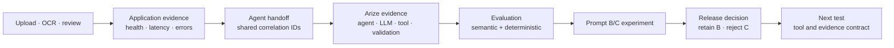

# Arize AI Project

## Grocery agent observability case study

I built a grocery comparison agent, traced its decisions in Arize AX, converted observed outcome gaps into a regression dataset, and tested a coverage-first prompt against the deployed demo baseline.

The candidate completed more searches and produced worse customer evidence at a higher operating cost. I rejected it.

This repository is private and provided only for Arize's take-home review. No license is granted for reuse or redistribution.

## Five product decisions

| Decision | Why it mattered |
| --- | --- |
| Use a familiar shopping decision with imperfect evidence. | Grocery comparison made relevance, package compatibility, incomplete coverage, and unsupported certainty visible without requiring a complex agent. |
| Let the agent write SQL, but keep authority in the application. | Model-authored queries exposed search strategy, retries, and ineffective behavior in traces. The application still enforced read-only access, budgets, evidence validation, and final-response rules. |
| Measure customer success separately from execution health. | A run with `OK` spans could still return incomplete or irrelevant recommendations. Customer outcome, agent behavior, application health, and platform health therefore remained separate evidence layers. |
| Correct the evidence contract before comparing prompts. | The baseline showed that unsearched items could be called unavailable. Contract `0.2.0` fixed that state invariant for both variants, preventing the correction from being misattributed to Prompt C. |
| Reject the candidate and invest in evaluation readiness. | Prompt C completed more searches but reduced critical relevance and increased time, tool calls, and completion tokens. I retained Prompt B and proposed an Evaluation Readiness Preflight to make future comparisons trustworthy before judge spend begins. |

## Five-minute reviewer path

| Time | Open | What it shows |
| --- | --- | --- |
| 0:00–0:40 | [Project brief](docs/PROJECT_BRIEF.md) | The customer decision, the controlled data boundary, and why the agent writes SQL. |
| 0:40–1:25 | [End-to-end evidence dashboard](docs/OBSERVABILITY_DASHBOARD.md) | Customer outcome, application health, exact Arize traces, serving edge, and the correlation boundary. |
| 1:25–2:25 | [Part 1 — Build, observe, and diagnose](docs/PART_1_BUILD_OBSERVE_DIAGNOSE.md) | The baseline trace evidence and the customer-outcome gap that started the experiment. |
| 2:25–3:40 | [Part 2 — Evaluate, improve, and decide](docs/PART_2_EVALUATE_IMPROVE_DECIDE.md) | The fixed test set, B/C result, evaluator coverage, and release decision. |
| 3:40–4:30 | [Product point of view](docs/PRODUCT_POINT_OF_VIEW.md) | The proposed Evaluation Readiness Preflight and the adoption gap it addresses. |
| 4:30–5:00 | [Agent definition](docs/AGENT_DEFINITION.md) and [evidence index](docs/EVIDENCE_INDEX.md) | The agent contract, its controls, and the source for each screenshot or Arize record. |

[Open the hosted demo](https://grocery.parkerwall-dev.workers.dev/). The app is access-controlled; temporary reviewer credentials are supplied separately in the submission email. See [reviewer access](docs/REVIEWER_ACCESS.md).

[Open the verified evidence dashboard](https://grocery.parkerwall-dev.workers.dev/observability?workflow_id=07f8d583-1f91-4caf-ad17-be788ee44edc&trace_id=21122189f4dcf5e942f1e6ff7f888ccd&trace_id=133d26595cc00e63bd93fb903dae4526). It uses the same reviewer credentials and loads one exact OCR-to-recommendation workflow.

This repository includes the agent definition, a [scrubbed executable reference](agent/README.md), and the evidence needed to review the case study. The reference preserves the agent’s contract, tool loop, policy gateway, validation boundary, and OpenInference/OTLP export without including the catalog, credentials, account configuration, or private application material.

## Observability boundary and improvement loop

The application records whether photo upload, OCR, list review, request handling, and response delivery worked. A shared `workflow_id` links that application evidence to the agent execution. Arize AX then provides the AI-specific evidence: model rounds, SQL tool calls, returned catalog rows, validation, token use, stopping behavior, and evaluator results.

| Evidence boundary | Question answered | Signals used here |
| --- | --- | --- |
| Application | Did the service accept, process, and return the request? | Request status, latency, errors, route, application events, and Cloudflare serving colo |
| Agent handoff | Which application request produced this agent run? | Workflow, request, run, trace, span, and release identifiers |
| Arize AX | What did the agent do, and did the evidence support the result? | OpenInference agent, LLM, tool, and validation spans; outcomes, stop reasons, tokens, and evaluations |
| Development decision | Should the candidate change ship? | Trace-derived cases, semantic judges, deterministic checks, experiment totals, and release criteria |

The baseline trace produced one implemented correction: an item cannot be labeled `unavailable` until the agent completes the required retailer searches. The Prompt B/C experiment did not produce a better candidate prompt. It showed that Prompt C increased coverage while reducing relevant evidence and increasing time, tool calls, and completion tokens. Arize helped prevent that regression from shipping and directed the next test toward the tool and evidence interface.

## Product

The customer uploads recipe or grocery-list photos, reviews the extracted items, and asks an agent to compare Costco and Walmart. The agent searches frozen retailer catalogs and returns product evidence, package size, snapshot price, an item-level recommendation, and a machine-readable package-comparison state. The deployed `0.2.1` guard compares raw snapshot prices only for conservatively established equivalent packages. It returns `review` for non-comparable packages and does not perform general unit-price optimization.

[Open the hosted demo](https://grocery.parkerwall-dev.workers.dev/)

This current result uses the app's built-in demo list. The historical [agent recommendation](assets/screenshots/03-agent-recommendation.png) is retained as diagnostic baseline evidence from contract `0.1.0`; it is not the current deployed demo result.

The catalogs contain licensed Kaggle records and labeled synthetic additions. They support repeatable tests and do not represent live price, promotion, inventory, or local-store availability.

## What the baseline trace found

One 14-item run completed 25 spans with `OK` status. The customer result was incomplete and partly irrelevant.

- Seven of 14 items were fully searched.
- The agent stopped at its model-round limit.
- Water matched canned chicken “in Water.”
- Celery matched celery salt.
- Carrots matched a prepared meal containing carrots.
- Seven unsearched items were described as unavailable.

The trace showed the difference between execution success and customer success. A completed query can return the wrong evidence. A completed trace can end with an incomplete task.

[Inspect the baseline trace evidence and diagnosis](docs/PART_1_BUILD_OBSERVE_DIAGNOSE.md).

## Experiment result

I added four observed runs to the `grocery-agent-regression-cases` dataset and compared Prompt B with Prompt C under the same model, catalogs, runtime, evaluator versions, and contract `0.2.0`. That shared contract required completed searches of both retailers before an item could be called unavailable. The correction from `0.1.0` was applied before both variants and is not counted as a Prompt C improvement.

| Outcome | Prompt B | Prompt C |
| --- | ---: | ---: |
| Completed item searches | 10/17 | 17/17 |
| Critical relevance pass | 3/4 | 0/4 |
| Total elapsed time | 45.188 s | 87.625 s |
| Tool calls | 24 | 35 |
| Completion tokens | 4,033 | 9,376 |

Prompt C met the coverage target and reduced customer outcome quality. I kept Prompt B as the deployed demo baseline.

[Inspect the run-level experiment evidence](docs/PART_2_EVALUATE_IMPROVE_DECIDE.md) or [verify the scrubbed eight-run export](evidence/experiment-runs.json).

## Evaluation approach

I used Arize-native evaluators for semantic judgments such as task completion, grounding, relevance, SQL generation, tool use, and step efficiency. I added deterministic checks for coverage, source identity, supported state, known category collisions, latency, tokens, calls, retries, and errors.

The two methods disagreed on several Prompt C runs. That disagreement was material to the release decision.

## Product recommendation

I would add an **Evaluation Readiness Preflight** between a trace-derived dataset and the first experiment. It would validate task fields, evaluator scope, context size, reference evidence, version lineage, operational measures, and expected score coverage before judge calls begin.

Arize already supports trace inspection, trace-to-dataset conversion, evaluators, and experiment comparison. The proposal tightens the handoff between those existing workflows.

## Why the agent writes SQL

I intentionally kept query formation inside the agent boundary. Model-authored SQL made schema interpretation, query choice, retries, candidate selection, and stopping behavior visible in Arize. The application limited the consequences through read-only execution, work budgets, evidence validation, and a server-built response.

This design exposed the search and decision behavior the assignment asked me to investigate. A fixed search function would have moved most of that behavior into application code.

## Supporting material

- [Assignment mapping](docs/ASSIGNMENT_MAPPING.md)
- [End-to-end evidence dashboard](docs/OBSERVABILITY_DASHBOARD.md)
- [Screenshot evidence index](docs/EVIDENCE_INDEX.md)
- [Experiment design](docs/EXPERIMENT_DESIGN.md)
- [Opportunities to improve](docs/FRICTION_LOG.md)
- [Product point of view](docs/PRODUCT_POINT_OF_VIEW.md)
- [Data and evidence boundaries](docs/DATA_AND_EVIDENCE.md)
- [Part 2 execution record](docs/PART_2_PLAN.md)
- [AI coding-tool use and verification](docs/AI_TOOL_USE.md)
- [Agent definition](docs/AGENT_DEFINITION.md)
- [Future hypotheses](docs/FUTURE_HYPOTHESES.md)

Arize links require access to the originating workspace. Screenshots are included so the argument does not depend on that access.
