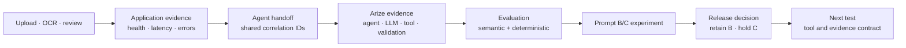

# Arize AI Project

## 60-second brief

| Question | Answer |
| --- | --- |
| What did I build? | A grocery comparison agent that writes bounded, read-only SQL against frozen Costco and Walmart catalogs. |
| Why this agent? | Model-authored queries expose search choice, retries, evidence selection, stopping behavior, latency, and token cost. |
| What did Arize reveal? | A run can complete without runtime errors and still return incomplete or irrelevant customer evidence. |
| What did I test? | Prompt B against a coverage-first Prompt C on four trace-derived cases under the same model, catalogs, runtime, contract, and evaluators. |
| What did I decide? | Retain Prompt B. Prompt C searched more items and reduced relevance while increasing time, tool calls, and completion tokens. |
| Where is the product opportunity? | Evaluation Readiness Preflight: help developers validate dataset fields, evaluator scope, context size, lineage, operational measures, and expected score coverage before the first scored experiment. |

This repository is public so the Arize review team can inspect the case study without a GitHub invitation. The hosted demo and originating Arize workspace remain access-controlled. No license is granted for reuse or redistribution.

## Decision record

| What the evidence showed | What it means | Product decision |
| --- | --- | --- |
| Completed searches increased from 10/17 to 17/17. | Prompt C achieved its coverage target. | Count as an improvement. |
| Critical product relevance fell from 3/4 to 0/4. | Additional searches did not produce usable customer evidence. | Prompt C did not meet the quality threshold. |
| Total elapsed time increased 93.9%. | The candidate increased customer wait. | Prompt C did not meet the operating threshold. |
| Tool calls increased 45.8%; completion tokens increased 132.5%. | The candidate required more work per test set. | Prompt C did not meet the efficiency threshold. |
| Native and deterministic evaluators disagreed; B produced 37/44 labels and C produced 36/44. | One aggregate could lead to a different release decision, and evaluator coverage was incomplete. | Review the run evidence and keep missing labels visible. |
| Prompt C did not meet the quality and operating thresholds. | Coverage alone did not improve the customer result. | Keep Prompt B deployed and revise the next hypothesis. |

## Reviewer path: the assignment in three parts

| Part | Reviewer question | Primary artifact |
| --- | --- | --- |
| 1. Build and observe | What did I build, why is it an agent, and what did the trace reveal? | [Part 1: Build, observe, and diagnose](docs/PART_1_BUILD_OBSERVE_DIAGNOSE.md) |
| 2. Evaluate and decide | What changed, how did I measure it, and should it ship? | [Part 2: Evaluate, improve, and decide](docs/PART_2_EVALUATE_IMPROVE_DECIDE.md) |
| 3. Propose an investment | Which observed adoption opportunity should Arize address, why first, and what is the MVP? | [Product point of view](docs/PRODUCT_POINT_OF_VIEW.md) |

Supporting evidence: [project brief](docs/PROJECT_BRIEF.md), [application observability dashboard](docs/OBSERVABILITY_DASHBOARD.md), [agent definition](docs/AGENT_DEFINITION.md), [evidence index](docs/EVIDENCE_INDEX.md), [AI tool-use disclosure](docs/AI_TOOL_USE.md), and [assignment mapping](docs/ASSIGNMENT_MAPPING.md).

[Open the hosted demo](https://grocery.parkerwall-dev.workers.dev/). The app is access-controlled; temporary reviewer credentials are supplied separately in the submission email. See [reviewer access](docs/REVIEWER_ACCESS.md).

[Open the verified application observability dashboard](https://grocery.parkerwall-dev.workers.dev/observability?workflow_id=07f8d583-1f91-4caf-ad17-be788ee44edc&trace_id=21122189f4dcf5e942f1e6ff7f888ccd&trace_id=133d26595cc00e63bd93fb903dae4526). It uses the same reviewer credentials and loads one exact OCR-to-recommendation workflow.

This repository includes the agent definition, a [scrubbed executable reference](agent/README.md), and the evidence needed to review the case study. The reference preserves the agent’s contract, tool loop, policy gateway, validation boundary, and OpenInference/OTLP export without including the catalog, credentials, account configuration, or private application material.

## Observability boundary and improvement loop

The application records whether photo upload, OCR, list review, request handling, and response delivery worked. A shared `workflow_id` links that application evidence to the agent execution. Arize AX then provides the AI-specific evidence: model rounds, SQL tool calls, returned catalog rows, validation, token use, stopping behavior, and evaluator results.

| Evidence boundary | Question answered | Signals used here |
| --- | --- | --- |
| Application | Did the service accept, process, and return the request? | Request status, latency, errors, route, application events, and Cloudflare serving colo |
| Agent handoff | Which application request produced this agent run? | Workflow, request, run, trace, span, and release identifiers |
| Arize AX | What did the agent do, and did the evidence support the result? | OpenInference agent, LLM, tool, and validation spans; outcomes, stop reasons, tokens, and evaluations |
| Development decision | Should the candidate change ship? | Trace-derived cases, semantic judges, deterministic checks, experiment totals, and release criteria |

The baseline trace produced one implemented correction: an item cannot be labeled `unavailable` until the agent completes the required retailer searches. The Prompt B/C experiment did not produce a better candidate prompt. It showed that Prompt C increased coverage while reducing relevant evidence and increasing time, tool calls, and completion tokens. Arize gave me enough evidence to keep that regression out of the deployed experience and focus the next test on the tool and evidence interface.

## Product

The customer uploads recipe or grocery-list photos, reviews the extracted items, and asks an agent to compare Costco and Walmart. The agent searches frozen retailer catalogs and returns product evidence, package size, snapshot price, an item-level recommendation, and a machine-readable package-comparison state. The deployed `0.2.1` guard compares raw snapshot prices only for conservatively established equivalent packages. It returns `review` for non-comparable packages and does not perform general unit-price optimization.

[Open the hosted demo](https://grocery.parkerwall-dev.workers.dev/)

This current result uses the app's built-in demo list. The historical [agent recommendation](assets/screenshots/03-agent-recommendation.png) is retained as diagnostic baseline evidence from contract `0.1.0`; it is not the current deployed demo result.

The catalogs contain licensed Kaggle records and labeled synthetic additions. They support repeatable tests and do not represent live price, promotion, inventory, or local-store availability.

## What the baseline trace found

One 14-item run completed 25 spans with `OK` status. The customer result was incomplete and partly irrelevant.

- Seven of 14 items were fully searched.
- The agent stopped at its model-round limit.
- Water matched canned chicken “in Water.”
- Celery matched celery salt.
- Carrots matched a prepared meal containing carrots.
- Seven unsearched items were described as unavailable.

The trace showed the difference between execution success and customer success. A completed query can return unrelated evidence. A completed trace can end with an incomplete task.

[Inspect the baseline trace evidence and diagnosis](docs/PART_1_BUILD_OBSERVE_DIAGNOSE.md).

## Experiment result

I added four observed runs to the `grocery-agent-regression-cases` dataset and compared Prompt B with Prompt C under the same OpenAI `gpt-4o-mini` agent configuration, catalogs, runtime, evaluator versions, and contract `0.2.0`. That shared contract required completed searches of both retailers before an item could be called unavailable. The correction from `0.1.0` was applied before both variants and is not counted as a Prompt C improvement.

| Outcome | Prompt B | Prompt C |
| --- | ---: | ---: |
| Completed item searches | 10/17 | 17/17 |
| Critical relevance pass | 3/4 | 0/4 |
| Total elapsed time | 45.188 s | 87.625 s |
| Tool calls | 24 | 35 |
| Completion tokens | 4,033 | 9,376 |

Prompt C met the coverage target, but the customer evidence became less relevant. I kept Prompt B as the deployed demo baseline and moved the next investigation to the tool and evidence contract.

[Inspect the run-level experiment evidence](docs/PART_2_EVALUATE_IMPROVE_DECIDE.md) or [verify the scrubbed eight-run export](evidence/experiment-runs.json).

## Evaluation approach

I used Arize-native evaluators for semantic judgments such as task completion, grounding, relevance, SQL generation, tool use, and step efficiency. I added deterministic checks for coverage, source identity, supported state, known category collisions, latency, tokens, calls, retries, and errors.

The two methods disagreed on several Prompt C runs. That disagreement was material to the release decision.

## Product recommendation

I would add an **Evaluation Readiness Preflight** between a trace-derived dataset and the first experiment. It would validate task fields, evaluator scope, context size, reference evidence, version lineage, operational measures, and expected score coverage before judge calls begin.

Arize already supports trace inspection, trace-to-dataset conversion, evaluators, and experiment comparison. The proposal tightens the handoff between those existing workflows.

### Decision horizon

| Horizon | Product decision |
| --- | --- |
| Build first | Evaluation Readiness Preflight, because the completed dogfooding workflow directly exposed the setup and evidence opportunity. |
| Validate next | The SRE governance use case for teams operating shared production agents. A versioned service contract would connect customer outcome, reliability, efficiency, and governance thresholds across experiments and live monitoring. |
| Preserve the boundary | Arize should define, measure, explain, and communicate an objective breach. The customer application should retain authority to stop, reroute, degrade, or require human review. |

[Read the prioritization and SRE governance use case](docs/PRODUCT_POINT_OF_VIEW.md#product-use-case-govern-a-shared-production-agent).

## Why the agent writes SQL

I intentionally kept query formation inside the agent boundary. Model-authored SQL made schema interpretation, query choice, retries, candidate selection, and stopping behavior visible in Arize. The application limited the consequences through read-only execution, work budgets, evidence validation, and a server-built response.

This design exposed the search and decision behavior the assignment asked me to investigate. A fixed search function would have moved most of that behavior into application code.

Arize links require access to the originating workspace. Screenshots are included so the argument does not depend on that access.
