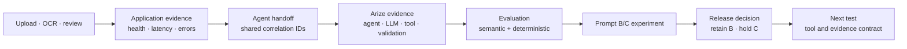

# Arize AI Project

## 60-second brief

| Question | Answer |
| --- | --- |
| What did I build? | A grocery comparison agent that writes bounded, read-only SQL against frozen Costco and Walmart catalogs. |
| Why this agent? | Model-authored queries expose search choice, retries, evidence selection, stopping behavior, latency, and token cost. |
| What did Arize reveal? | A run can complete without runtime errors and still return incomplete or irrelevant customer evidence. |
| What did I test? | Prompt B against a coverage-first Prompt C on four trace-derived cases under the same model, catalogs, runtime, contract, and evaluators. |
| What did I decide? | Retain Prompt B. Prompt C searched more items and reduced relevance while increasing time, tool calls, and completion tokens. |
| Where is the product opportunity? | Evaluation Readiness Preflight: extend Arize's existing mapping and preview tools into a release-decision check before evaluator calls begin. |

This repository is public so the Arize review team can inspect the case study without a GitHub invitation. The hosted demo and originating Arize workspace remain access-controlled. No license is granted for reuse or redistribution.

## Decision record

| What the evidence showed | What it means | Product decision |
| --- | --- | --- |
| Completed searches increased from 10/17 to 17/17. | Prompt C achieved its coverage target. | Count as an improvement. |
| Critical product relevance fell from 3/4 to 0/4. | Additional searches did not produce usable customer evidence. | Prompt C did not meet the quality threshold. |
| Total elapsed time increased 93.9%. | The candidate increased customer wait. | Prompt C did not meet the operating threshold. |
| Tool calls increased 45.8%; completion tokens increased 132.5%. | The candidate required more work per test set. | Prompt C did not meet the efficiency threshold. |
| Native and deterministic evaluators disagreed; B produced 37/44 labels and C produced 36/44. | One aggregate could lead to a different release decision, and evaluator coverage was incomplete. | Review the run evidence and keep missing labels visible. |
| Prompt C did not meet the quality and operating thresholds. | Coverage alone did not improve the customer result. | Keep Prompt B deployed and revise the next hypothesis. |

## Reviewer path: the assignment in three parts

| Part | Reviewer question | Primary artifact |
| --- | --- | --- |
| 1. Build and observe | What did I build, why is it an agent, and what did the trace reveal? | [Part 1: Build, observe, and diagnose](docs/PART_1_BUILD_OBSERVE_DIAGNOSE.md) |
| 2. Evaluate and decide | What changed, how did I measure it, and should it ship? | [Part 2: Evaluate, improve, and decide](docs/PART_2_EVALUATE_IMPROVE_DECIDE.md) |
| 3. Propose an investment | Which observed adoption opportunity should Arize address, why first, and what is the MVP? | [Product point of view](docs/PRODUCT_POINT_OF_VIEW.md) |

Supporting evidence: [project brief](docs/PROJECT_BRIEF.md), [application observability dashboard](docs/OBSERVABILITY_DASHBOARD.md), [agent definition](docs/AGENT_DEFINITION.md), [evidence index](docs/EVIDENCE_INDEX.md), [AI tool-use disclosure](docs/AI_TOOL_USE.md), and [assignment mapping](docs/ASSIGNMENT_MAPPING.md).

[Open the hosted demo](https://grocery.parkerwall-dev.workers.dev/). The app is access-controlled; temporary reviewer credentials are supplied separately in the submission email. See [reviewer access](docs/REVIEWER_ACCESS.md).

[Open the verified application observability dashboard](https://grocery.parkerwall-dev.workers.dev/observability?workflow_id=07f8d583-1f91-4caf-ad17-be788ee44edc&trace_id=21122189f4dcf5e942f1e6ff7f888ccd&trace_id=133d26595cc00e63bd93fb903dae4526). It uses the same reviewer credentials and loads one exact OCR-to-recommendation workflow.

This repository includes the agent definition, a [scrubbed executable reference](agent/README.md), and the evidence needed to review the case study. The reference preserves the agent’s contract, tool loop, policy gateway, validation boundary, and OpenInference/OTLP export without including the catalog, credentials, account configuration, or private application material.

## What I built and learned

The customer uploads recipe or grocery-list photos, reviews the extracted items, and asks an agent to compare Costco and Walmart. I intentionally kept SQL query formation inside the agent boundary so Arize could expose schema interpretation, search choice, retries, evidence selection, stopping behavior, latency, and token use. The application limits the consequences through read-only execution, work budgets, evidence validation, and a server-built response.

The first 14-item run completed 25 spans with `OK` status, yet only seven items were fully searched. Water matched canned chicken “in Water,” celery matched celery salt, carrots matched a prepared meal, and unsearched items were described as unavailable. The trace made the product opportunity concrete: execution success did not guarantee a useful customer outcome.

I converted that behavior into four regression cases, defined reference behavior, and compared Prompt B with a coverage-first Prompt C. Both variants used the same OpenAI `gpt-4o-mini` configuration, catalogs, runtime, evaluator versions, and agent contract. Prompt C completed all 17 requested searches, but critical relevance fell from 3/4 to 0/4 while latency, tool calls, and completion tokens increased. I kept Prompt B deployed and moved the next hypothesis to the tool and evidence contract.

The catalogs contain licensed Kaggle records and labeled synthetic additions. They support controlled, repeatable tests and do not represent live price, promotion, inventory, or local-store availability.

[Inspect the baseline trace](docs/PART_1_BUILD_OBSERVE_DIAGNOSE.md), [review the experiment decision](docs/PART_2_EVALUATE_IMPROVE_DECIDE.md), or [verify the scrubbed run export](evidence/experiment-runs.json).

## Observability boundary and improvement loop

The application records whether photo upload, OCR, list review, request handling, and response delivery worked. A shared `workflow_id` links that application evidence to the agent execution. Arize AX then provides the AI-specific evidence: model rounds, SQL tool calls, returned catalog rows, validation, token use, stopping behavior, and evaluator results.

| Evidence boundary | Question answered | Signals used here |
| --- | --- | --- |
| Application | Did the service accept, process, and return the request? | Request status, latency, errors, route, application events, and Cloudflare serving colo |
| Agent handoff | Which application request produced this agent run? | Workflow, request, run, trace, span, and release identifiers |
| Arize AX | What did the agent do, and did the evidence support the result? | OpenInference agent, LLM, tool, and validation spans; outcomes, stop reasons, tokens, and evaluations |
| Development decision | Should the candidate change ship? | Trace-derived cases, semantic judges, deterministic checks, experiment totals, and release criteria |

The baseline trace produced one implemented correction: an item cannot be labeled `unavailable` until the agent completes the required retailer searches. The Prompt B/C experiment did not produce a better candidate prompt. It showed that Prompt C increased coverage while reducing relevant evidence and increasing time, tool calls, and completion tokens. Arize gave me enough evidence to keep that regression out of the deployed experience and focus the next test on the tool and evidence interface.

## Evaluation approach

I used Arize-native evaluators for semantic judgments such as task completion, grounding, relevance, SQL generation, tool use, and step efficiency. I added deterministic checks for coverage, source identity, supported state, known category collisions, latency, tokens, calls, retries, and errors.

The two methods disagreed on several Prompt C runs. That disagreement was material to the release decision.

## Product recommendation

Prompt C showed why an agent release decision cannot rely on coverage alone: completed searches rose from 10/17 to 17/17 while critical relevance fell from 3/4 to 0/4, elapsed time increased 93.9%, and evaluator coverage remained incomplete.

Arize already helps developers map fields, preview values, configure evaluators, and compare experiments. The remaining opportunity is to confirm that those components will produce enough evidence for the release decision before evaluator calls begin.

I would add an **Evaluation Readiness Preflight** that validates an experiment against its stated decision, target outcome, quality and operating guardrails, expected score coverage, and version lineage. The result is one reviewable record showing whether the evidence is ready to support a promote, revise, or hold decision.

The proposal builds on Arize's existing workflow. It preserves current mappings and previews, then uses them as inputs to a decision-level readiness check.

### Decision horizon

| Horizon | Product decision |
| --- | --- |
| Build first | Evaluation Readiness Preflight, because the completed dogfooding workflow showed that individually valid components did not guarantee a decision-ready experiment. |
| Validate next | The SRE governance use case for teams operating shared production agents. A versioned service contract would connect customer outcome, reliability, efficiency, and governance thresholds across experiments and live monitoring. |
| Preserve the boundary | Arize should define, measure, explain, and communicate an objective breach. The customer application should retain authority to stop, reroute, degrade, or require human review. |

[Read the prioritization and SRE governance use case](docs/PRODUCT_POINT_OF_VIEW.md#product-use-case-govern-a-shared-production-agent).

Arize links require access to the originating workspace. Screenshots are included so the argument does not depend on that access.
