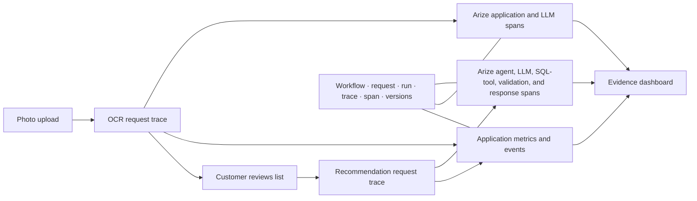
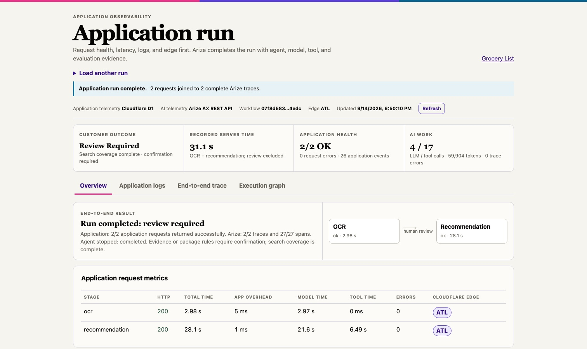
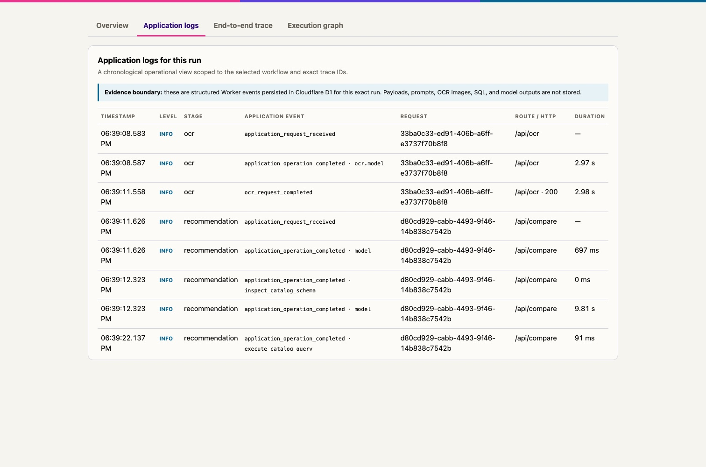
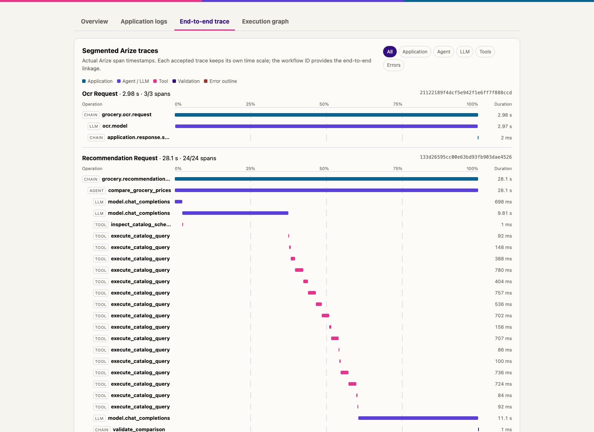
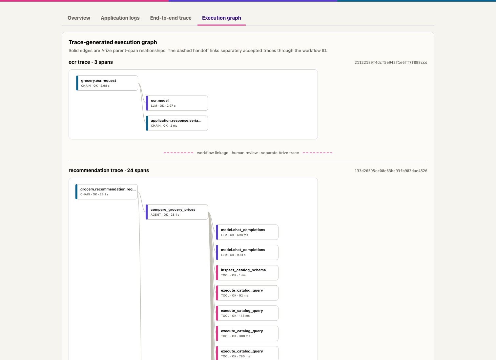

# Application observability dashboard

[Open the verified hosted workflow](https://grocery.parkerwall-dev.workers.dev/observability?workflow_id=07f8d583-1f91-4caf-ad17-be788ee44edc&trace_id=21122189f4dcf5e942f1e6ff7f888ccd&trace_id=133d26595cc00e63bd93fb903dae4526).

The page uses the demo credentials supplied in the submission email. It loads a saved workflow and does not trigger another model run.

## The decision it supports

The dashboard starts with application telemetry and uses Arize telemetry to complete the run. It is an evidence prototype for one operating question:

> When a customer result needs review, can an operator tell whether the cause sits in the application path, the agent trajectory, or the evidence the agent returned?

It keeps four states separate:

| State | Question |
| --- | --- |
| Customer outcome | Was the recommendation supported strongly enough to use? |
| Trace completeness | Did Arize return every expected span and parent link? |
| Application health | Did OCR and recommendation requests finish without HTTP or runtime errors? |
| Agent execution | Which model and SQL-tool steps produced the result, at what latency and token cost? |

## Verified workflow

| Evidence | Observed value |
| --- | --- |
| Workflow | `07f8d583-1f91-4caf-ad17-be788ee44edc` |
| OCR trace | `21122189f4dcf5e942f1e6ff7f888ccd` |
| Recommendation trace | `133d26595cc00e63bd93fb903dae4526` |
| Agent run | `4347c4eb-6081-4e20-a51a-ba0402824b42` |
| Trace completeness | 2/2 traces; 27/27 expected spans |
| Span mix | 4 application, 1 agent, 4 LLM, 17 tool, 1 validation |
| Recorded server time | 31.073 seconds |
| Model and tool time | 24.573 seconds model; 6.493 seconds tool |
| Token use | 56,966 prompt; 2,938 completion; 59,904 total |
| Reliability | 0 error spans; 0 orphaned spans; 0 missing LLM token records |
| Application evidence | 2 request-metric records; 26 structured events |
| Serving edge | Cloudflare `ATL` colo for both requests |
| Agent result | `review_required` |
| Agent stop reason | `completed` |

The final two rows matter. The agent completed its permitted loop, and the application returned successfully, but the result still required review. Zero unresolved items means search coverage was complete. Evidence or package rules can still require customer confirmation. The dashboard does not translate a green HTTP status or an `OK` span into a claim of customer success.

## Trace-readiness finding

The canonical workflow above was complete on its first dashboard read. An earlier workflow exposed a different state: the first exact lookup returned 13 of 17 expected spans, and a later lookup returned all 17. This is one observed workflow, not a universal ingestion guarantee. It showed why the dashboard needs an explicit completeness state: accepted trace data may still be incomplete during indexing.

## Evidence boundary

OpenTelemetry supplies request and span structure. OpenInference adds agent, model, tool, token, outcome, and evaluation meaning. D1 holds a bounded application projection for the demonstration. The server joins those sources and returns only allowlisted operational fields; it does not expose source images, grocery text, prompts, SQL, model outputs, or credentials.

## What to inspect

1. **Overview and application metrics:** inspect request completion, server time, errors, application events, and serving colo before interpreting the AI work.

   

2. **Application logs:** follow the two request boundaries and 22 model or tool completion events under the same workflow identifier.

   

3. **End-to-end trace:** use Arize spans to follow the separate OCR and recommendation requests and verify the human-review handoff is not presented as one long server span.

   

4. **Execution graph:** inspect the parent-child path from recommendation request to agent, model, SQL tools, validation, and response.

   

The dashboard makes a boundary visible that Arize AX and an application monitoring system normally present in separate views. It is an exploration of the operator experience, not a claim that Arize should become a general log store.

## Current limits

- The page depends on the hosted Worker and its server-side Arize reader.
- The Cloudflare colo identifies the serving edge, not the shopper's precise location or the full downstream network path.
- Recorded server time excludes the customer review interval between OCR and recommendation.
- Aggregate span time can exceed wall-clock time when operations overlap.
- This workflow proves the correlation pattern for the demonstration. It does not establish a universal cross-vendor schema.
