# Part 1 — Build, observe, and diagnose

## What I built

I built a grocery comparison agent around a real customer decision: which items should I buy at Costco, and which should I buy at Walmart?

The customer uploads recipe or grocery-list photos. OCR produces a structured list. The customer reviews that list, then asks the agent to compare both retailers. The agent searches frozen Costco and Walmart catalogs and returns product evidence, package size, snapshot price, and an item-level recommendation. Weak evidence produces a review state. Missing evidence produces an unresolved or unavailable state, depending on whether the searches completed.

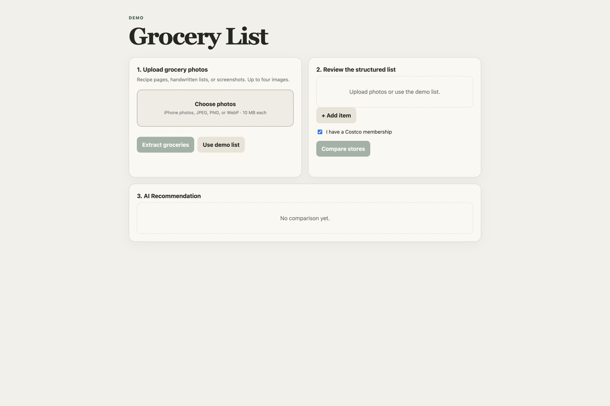

I uploaded `demo1.PNG` to the hosted application and ran OCR. The app returned eight editable items and stopped at the customer-review boundary; no retailer comparison had run yet.

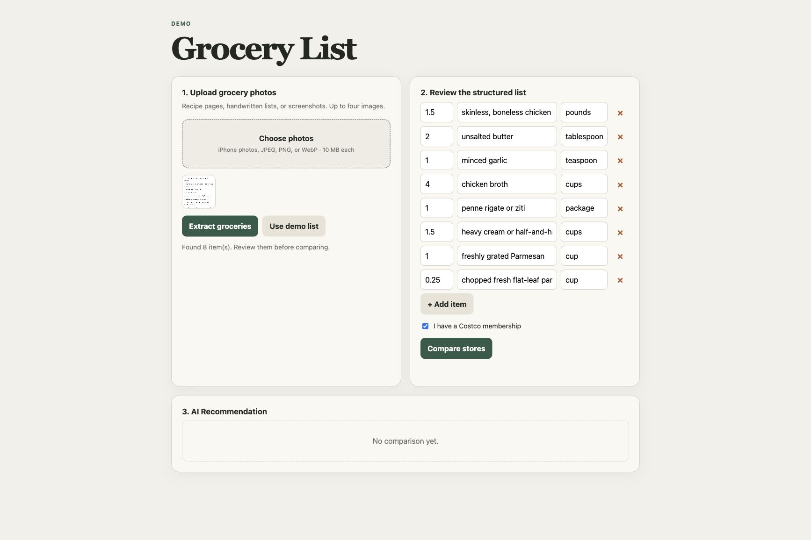

The catalogs contain licensed Kaggle source rows and labeled synthetic additions. They create a repeatable test environment with realistic grocery coverage, package differences, price differences, close matches, and distractors. The application does not claim live prices, promotions, inventory, or local-store availability.

## Why this is an agent

OCR prepares the input. The agent starts after the customer approves the list.

For every item, the agent decides how to search two different catalog tables. It inspects the available schema, writes read-only SQL, reviews the returned candidates, reformulates weak searches when useful, and decides when it has enough evidence to stop. The application then validates the collected evidence and builds the customer response.

I intentionally kept query formation inside the agent. This gave the model enough freedom to make visible search decisions and visible mistakes. A fixed search tool would have reduced implementation risk, but it would also have hidden query quality, retries, and no-progress behavior inside application code. Model-authored SQL made those behaviors available to traces, evaluations, and prompt experiments.

That separation gave me two quality domains:

- OCR quality: whether the reviewed grocery item is correct.
- Agent quality: whether search, evidence selection, and stopping behavior support the reviewed item.

## Customer flow

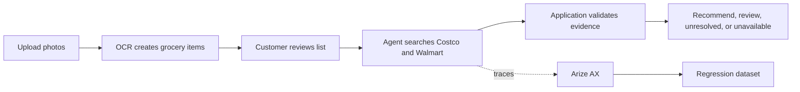

The customer-facing contract is one result per requested item. Each result includes the retailer evidence and a clear outcome.

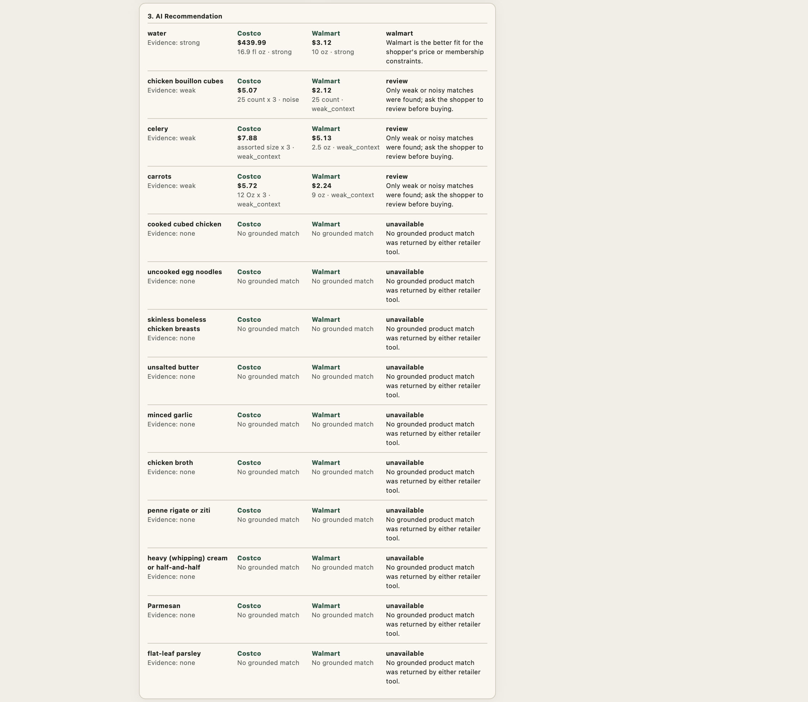

The image above is historical diagnostic evidence captured before the shared 0.2.0 state-invariant correction. It preserves the original failure under investigation and should not be read as the current deployed demo result. The current deployed demo result is shown below using the built-in demo list; it is hosted-demo evidence, not OCR evidence.

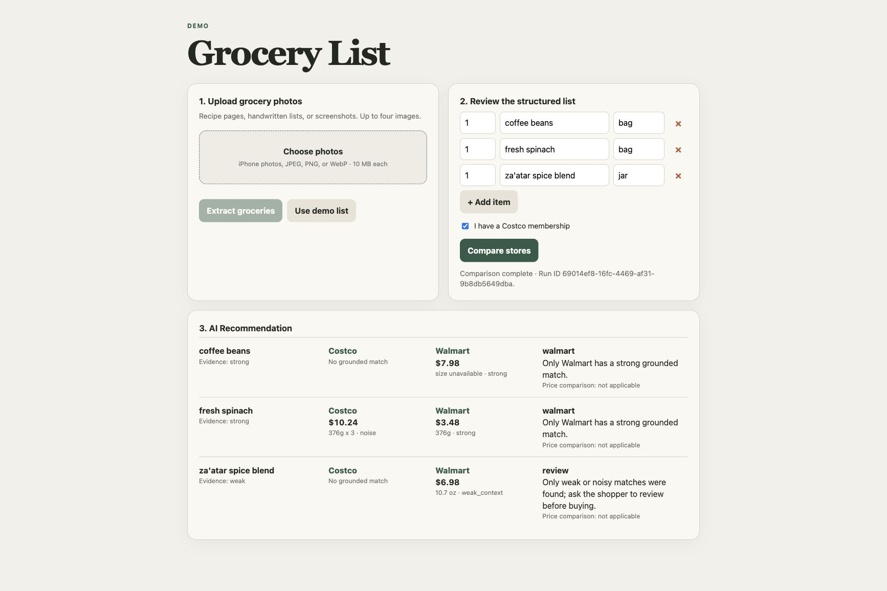

## The control boundary

I wanted the model to make observable decisions. I allowed it to inspect the catalog schema and write SQL. The application owns the limits around that freedom.

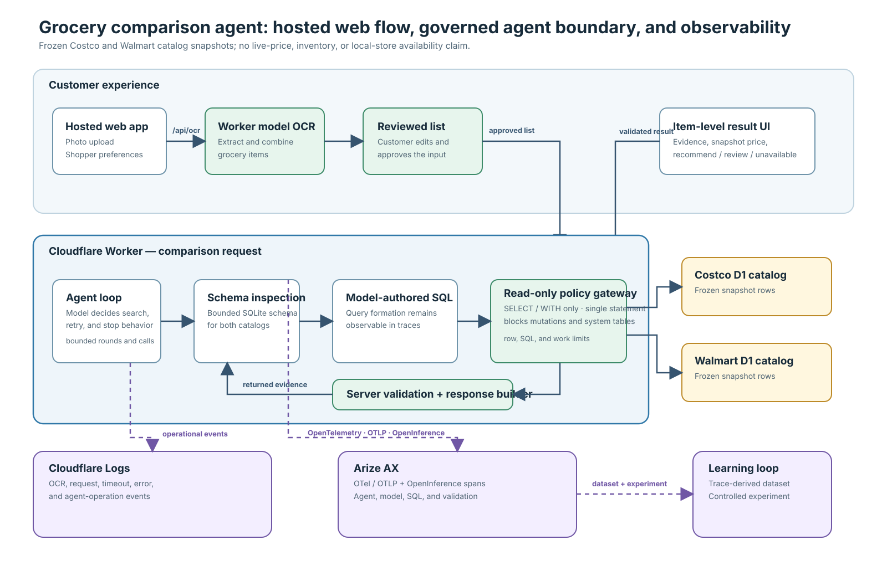

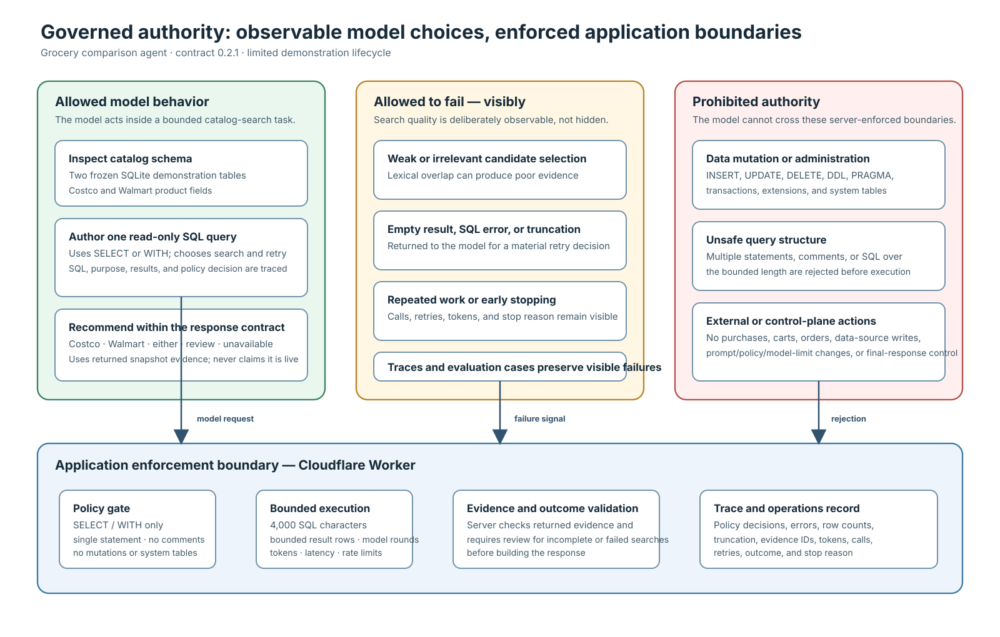

The application enforces read-only, single-statement SQL, blocks administrative operations and system-table access, limits returned rows, caps model and tool work, and validates the final response. It also pins the hosted demo to the server-selected deployed demo baseline. Prompt overrides are available only through the controlled experiment path.

The model can still write ineffective SQL, choose a weak candidate, repeat work, or stop too early. Those behaviors form the experiment evidence. The model cannot mutate the retailer data or change its own operating limits.

## What I sent to Arize

The Worker records the agent run with OpenTelemetry and OpenInference semantics. Arize receives one root agent span with child spans for model calls, schema inspection, SQL execution, and response validation.

The trace includes:

- prompt, policy, contract, model, catalog, and environment versions;
- model and tool inputs and outputs;
- SQL, gateway decisions, returned evidence IDs, and errors;
- latency, token, model-call, tool-call, retry, and error counts;
- task outcome, stop reason, review state, and unresolved-item count.

This structure let me inspect one request from the customer outcome down to a specific query. It also exposed an opportunity to improve trace continuity: OCR and agent comparison are separate requests, and traces are exported after the agent returns. A failed invocation or hard timeout can remain visible in Cloudflare logs without producing a complete Arize trace.

## Baseline investigation

The baseline was Prompt B with `search-policy-v1` under contract `0.1.0`. I inspected trace `8dda9755f410fbdb64660809779cd9fe`.

| Signal | Baseline result |
| --- | ---: |
| Contract version | `0.1.0` |
| Requested items | 14 |
| Items fully searched | 7 |
| Spans | 25 |
| End-to-end latency | 18.604 seconds |
| Model calls | 8 |
| Tool calls | 15 |
| Prompt tokens | 29,168 |
| Completion tokens | 1,020 |
| Span status | All `OK` |
| Task outcome | `review_required` |
| Stop reason | `round_budget_exhausted` |

[Open the baseline trace in Arize AX](https://app.arize.com/organizations/QWNjb3VudE9yZ2FuaXphdGlvbjo0OTg1ODpuWmlx/spaces/U3BhY2U6NTM1NjU6aW1TSw==/projects/TW9kZWw6OTc1NDYyMzE5MTpzckh2?selectedTraceId=8dda9755f410fbdb64660809779cd9fe&selectedSpanId=cd404e9879a8558a&traceViewId=__arize_default&selectedTab=llmTracing&envA=tracing&modelType=generative_llm) (workspace access required).

The run executed cleanly while the customer result remained incomplete. That distinction became the central observation for the project. Technical completion did not prove task completion, evidence relevance, or a useful recommendation.

## Trace finding 1: lexical overlap looked like product relevance

The customer asked for water. The agent wrote valid SQL and received rows from both catalogs.

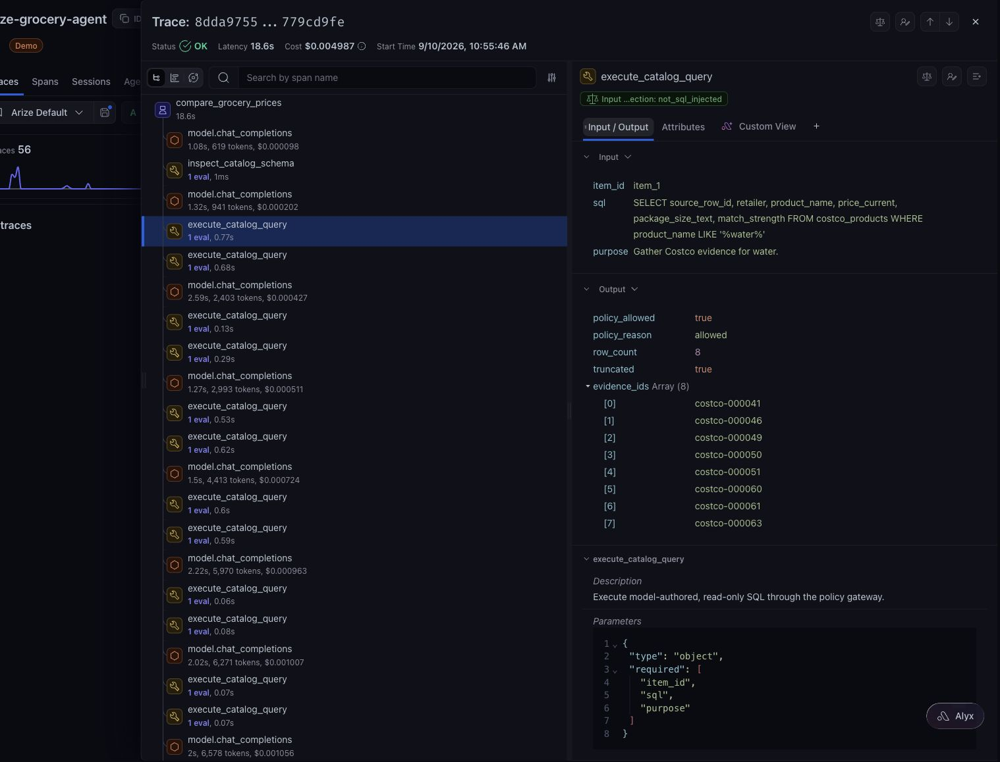

Costco returned a large bottled-water package. Walmart returned canned chicken breast whose title contained “in Water.” The agent treated the word match as product equivalence and recommended Walmart.

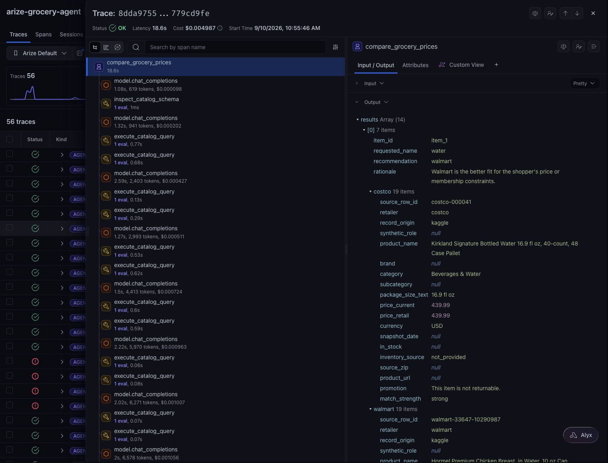

The same run matched celery to celery salt and carrots to a prepared pot roast containing carrots. The database and SQL gateway worked as designed. The search and evidence-selection policy accepted irrelevant evidence.

## Trace finding 2: an execution limit became a false marketplace claim

The agent completed both retailer searches for seven of 14 items. It then reached its model-round limit. The response still contained 14 rows and described the seven unsearched items as unavailable.

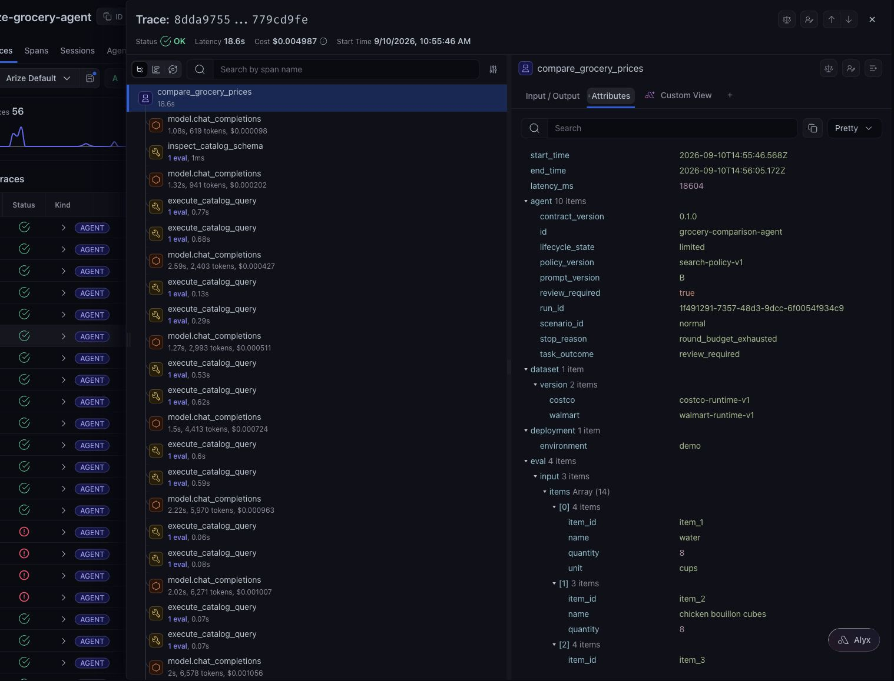

The evidence only supported `unsearched` or `unresolved`. `Unavailable` requires completed Costco and Walmart searches. I moved that rule into contract `0.2.0` before running either experiment variant: incomplete or failed searches return `review`. Prompt B and Prompt C both used `0.2.0`, so the correction is a shared control, not a Prompt C result.

## Trace finding 3: agent work dominated database time

Model calls consumed 1.077–2.593 seconds each. SQL calls consumed 62–770 milliseconds. Prompt context grew from 608 tokens on the first model call to 6,423 on the largest.

This changed the optimization target. Faster SQL would not address incomplete coverage or repeated model context. Any candidate change needed to report customer quality and the cost of achieving it: latency, model calls, tool calls, and tokens.

## From trace to experiment

I converted four observed runs into the `grocery-agent-regression-cases` dataset.

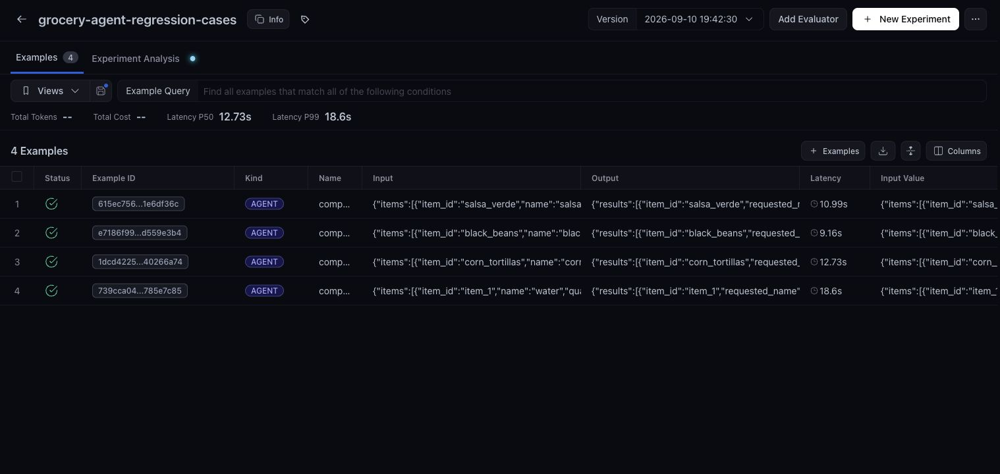

Before running the experiment, I defined the expected behavior for each case. The reference required complete retailer search, category-compatible evidence, preference-aware reasoning, truthful uncertainty, and no live-data claim. It did not prescribe Costco or Walmart as the correct answer because the catalog evidence should determine that choice.

I used deterministic checks for facts that could be tested directly: item coverage, source identity, supported state, calls, tokens, errors, and latency. I used Arize-native model evaluators for semantic judgments such as relevance, grounding, task completion, and step efficiency.

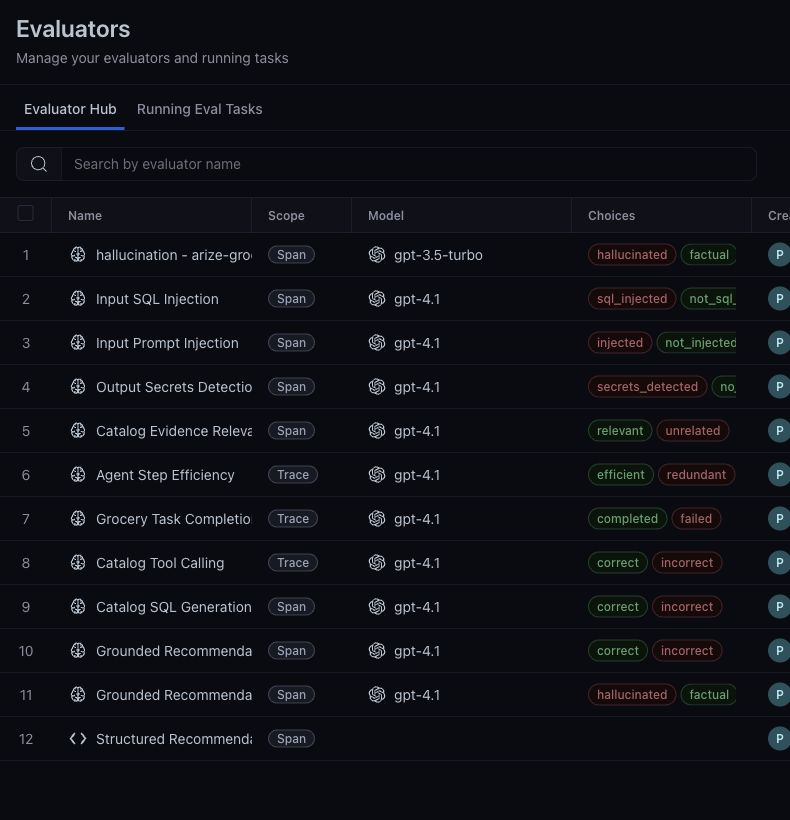

## Part 1 decision

The baseline established a specific hypothesis for Part 2:

> A coverage-first search policy should complete more retailer searches and reject category-incompatible matches without creating an unacceptable latency, token, or tool-use regression.

The trace supported the hypothesis as a test. It did not support shipping the proposed change. [Part 2](PART_2_EVALUATE_IMPROVE_DECIDE.md) runs the controlled comparison and makes that decision.

The complete authority and behavior contract is in [Agent definition](AGENT_DEFINITION.md).
