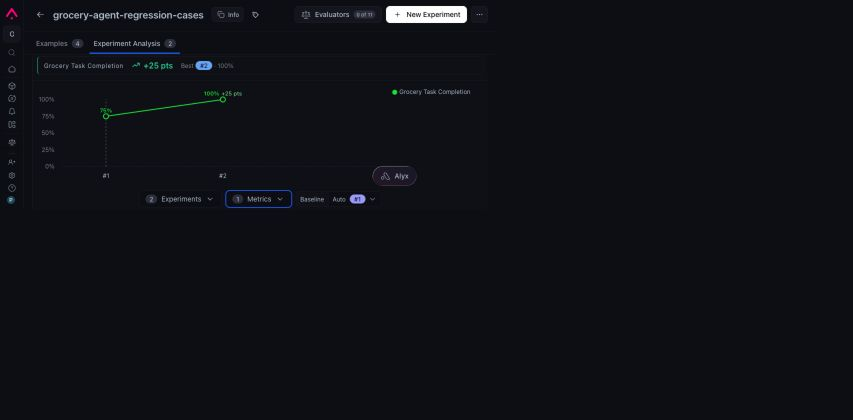
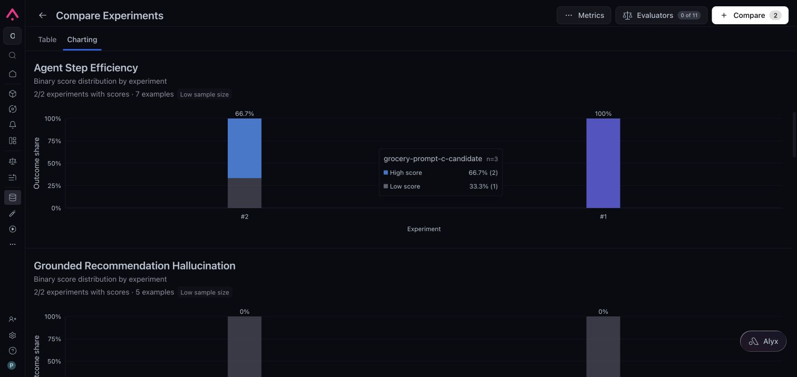
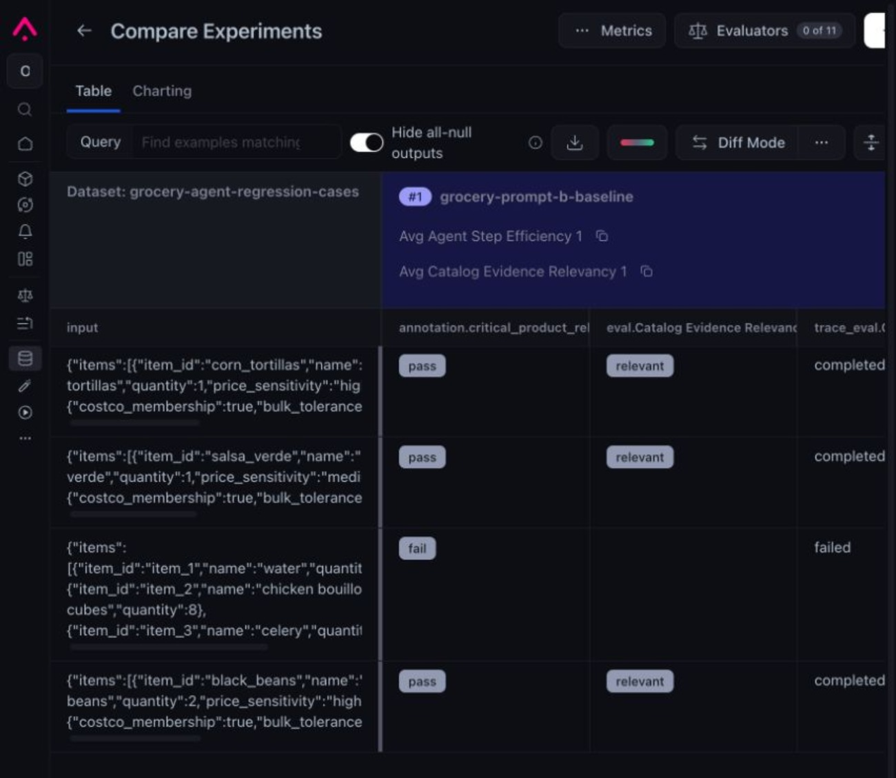
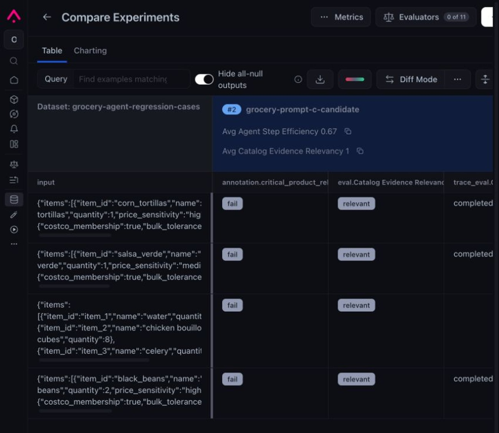
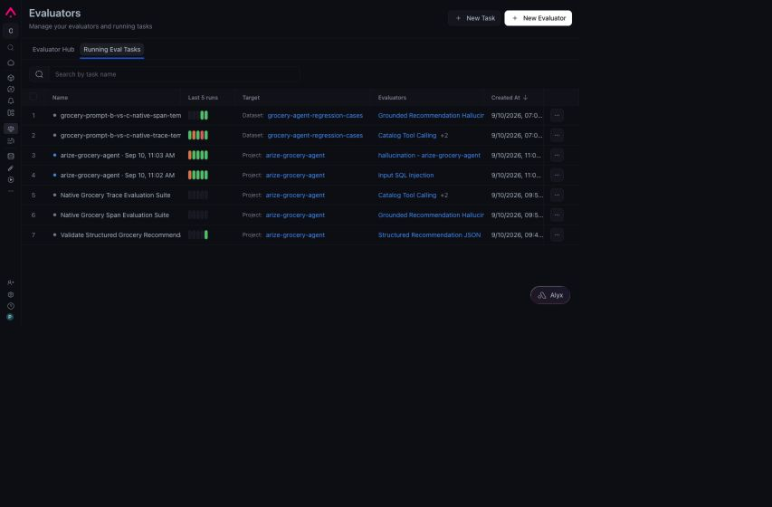
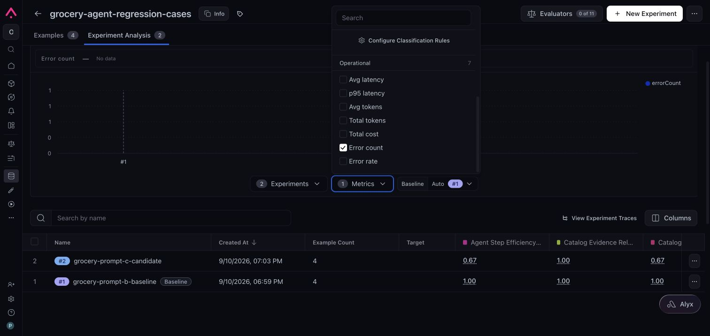

# Part 2 — Evaluate, improve, and decide

## Decision

I rejected Prompt C v2.2 and kept Prompt B as the deployed demo baseline.

Prompt C completed every requested retailer search. It also returned worse product evidence, took almost twice as long, issued more tool calls, and generated more than twice the completion tokens. Full coverage did not produce a better customer result.

## What I tested

Part 1 produced four regression cases from observed traces:

- a 14-item recipe containing the water, celery, and carrots collisions;
- corn tortillas;
- black beans;
- salsa verde.

I wrote the reference behavior before running either variant. The reference required complete Costco and Walmart search, category-compatible evidence, shopper-aware reasoning, truthful uncertainty, and no live-data claim. It did not prescribe a retailer winner.

I held the model, catalog versions, Worker path, database, SQL gateway, response contract, cases, and evaluator versions constant. The exact settings, including the agent model and the separately provider-managed evaluator model group, are in the [controlled configuration record](EXPERIMENT_DESIGN.md#controlled-configuration-record). Both variants used contract `0.2.0`: `unavailable` required completed Costco and Walmart searches, while incomplete or failed searches returned `review`. The prompt and search policy were the independent variable.

The Part 1 diagnostic trace used contract `0.1.0` and exposed the false unavailable state. I introduced `0.2.0` before running either B or C. The experiment does not count that shared correction as a Prompt C improvement.

| Variant | Purpose |
| --- | --- |
| Prompt B / `search-policy-v1` | Deployed demo baseline |
| Prompt C / `search-policy-v2.2` | Coverage-first candidate |

The hosted application stayed on Prompt B. I ran B and C through a separate experiment endpoint that accepted only those two versions.

- [Open Prompt B in Arize AX](https://app.arize.com/organizations/QWNjb3VudE9yZ2FuaXphdGlvbjo0OTg1ODpuWmlx/spaces/U3BhY2U6NTM1NjU6aW1TSw==/datasets/RGF0YXNldDozNjQ2OTQ6YVlxdQ==/experiments/compare?experimentId=RXhwZXJpbWVudDoxNDIxMjY6b201Uw%3D%3D) (workspace access required)
- [Open Prompt C in Arize AX](https://app.arize.com/organizations/QWNjb3VudE9yZ2FuaXphdGlvbjo0OTg1ODpuWmlx/spaces/U3BhY2U6NTM1NjU6aW1TSw==/datasets/RGF0YXNldDozNjQ2OTQ6YVlxdQ==/experiments/compare?experimentId=RXhwZXJpbWVudDoxNDIxMjc6RDJIYQ%3D%3D) (workspace access required)

## What changed in Prompt C

Prompt C told the agent to:

- track whether both retailers had been searched for every item;
- prefer one bounded cross-retailer query per item;
- remove preparation language such as “cooked” or “cubed” when searching;
- use category evidence to reject lexical collisions;
- make at most one materially different reformulation;
- track unresolved work during search planning.

The prompt change targeted the two Part 1 findings: incomplete coverage and irrelevant matches. Final state classification remained the responsibility of shared contract `0.2.0` for both variants.

## The preflight revisions mattered

I ran Prompt C on one case before spending the full experiment.

The first candidate changed the reviewed item ID `black_beans` into retailer-specific IDs. The server rejected the tool calls. The agent repeated them until it exhausted the round budget. That trace recorded 14 errors.

I kept the runtime contract fixed and changed the prompt. The next candidate used the correct item ID, then replaced the stored retailer field with title-cased text. SQL returned rows, but the evidence resolver could not validate their retailer identity.

I changed the prompt again and recorded the final candidate as `search-policy-v2.2`. The fixed server contract exposed model mistakes and did not silently repair them.

## What Arize showed

Arize's native task-completion score increased from 75% to 100%.

Native step efficiency moved in the opposite direction, from 100% to 66.7%.

Those two charts were enough to reject a one-metric decision. I exported the runs, attached deterministic annotations, and inspected the source outputs and traces.

The scrubbed [run-level evidence artifact](../evidence/experiment-runs.json) contains all four rows for each variant. It preserves the fields needed to verify the decision without including prompts, credentials, raw payloads, or unnecessary Arize identifiers. Its reconciliation block independently derives the reported aggregate table and reports no mismatches.

## Verified results

| Measure | Prompt B | Prompt C v2.2 | Change |
| --- | ---: | ---: | ---: |
| Contract pass | 4/4 | 4/4 | No change |
| Critical product relevance | 3/4 | 0/4 | −75 points |
| Completed item searches | 10/17 (58.8%) | 17/17 (100%) | +41.2 points |
| Unresolved items | 7 | 0 | −7 |
| Total elapsed time | 45.188 s | 87.625 s | +93.9% |
| Model calls | 17 | 12 | −29.4% |
| Tool calls | 24 | 35 | +45.8% |
| Prompt tokens | 36,542 | 37,754 | +3.3% |
| Completion tokens | 4,033 | 9,376 | +132.5% |
| Runtime errors | 0 | 0 | No change |

Prompt C met its coverage goal. It searched all 17 requested items and reduced the number of model rounds.

The customer result was worse:

- The recipe still matched chicken packed in water to water, celery salt to celery, and pot roast containing carrots to carrots.
- Corn tortillas, black beans, and salsa verde were marked unavailable because the candidate did not return usable retailer evidence.
- The candidate took 42.437 more seconds across four runs.
- The candidate used 11 more tool calls and 5,343 more completion tokens.

Accepted SQL and zero runtime errors did not prove that the evidence was usable.

## Why I combined two evaluation methods

The Prompt B capture identifies the four grocery inputs and the `grocery-prompt-b-baseline` experiment. Three rows pass deterministic critical relevance; the 14-item recipe fails. The same rows show their native relevance and task-completion labels. The image proves those visible run-level labels; it does not, by itself, establish the full aggregate or prove every baseline output is correct.

The Prompt C capture shows the same four grocery inputs under `grocery-prompt-c-candidate`. Every deterministic critical-relevance check fails, while native relevance remains `relevant`; three visible task-completion labels say `completed`. The image proves that run-level disagreement in Arize. It does not, by itself, establish the full aggregate or imply that semantic labels override deterministic failures.

Arize-native evaluators measured semantic concerns such as relevance, task completion, grounding, SQL generation, tool use, and step efficiency.

Deterministic checks measured facts already present in the run:

- every requested item had one result;
- both retailer searches completed before an item was called unavailable;
- retailer and source IDs resolved to authoritative evidence;
- critical cases avoided known category collisions;
- latency, tokens, calls, retries, errors, and unresolved items stayed visible.

Several model judges called Prompt C's single-item outputs relevant, factual, correct, or complete. The deterministic relevance check rejected those runs because expected products existed and the agent returned no usable evidence.

The disagreement was part of the result. A fluent abstention can pass a semantic judge while hiding a tool-contract mismatch.

## Native evaluator coverage

I configured eight span-level and three trace-level Arize templates. Arize required separate tasks for the two scopes.

The final export contained:

- Prompt B: 37 of 44 expected native labels;
- Prompt C: 36 of 44 expected native labels.

Most missing labels came from provider throttling. The 14-item recipe exceeded one evaluator's context window when the full output was mapped into the evaluator prompt. A normal retry did not retry failed records. The override path reran successful calls along with failures.

I kept missing labels explicit. They were not counted as passes.

## Arize opportunities to improve

The experiment comparison offered average latency, total tokens, and error-count columns. Those columns were blank even though the values existed in the experiment output and source traces.

This made the quality change easier to see than its operating cost. I attached normalized deterministic measures so the release decision included both.

The work identified four connected opportunities:

1. Developers need to validate field mappings, evaluator scope, context size, reference evidence, and available measures before running an experiment.
2. Failed evaluator calls need a failed-only retry path.
3. Expected, completed, failed, and missing labels need explicit coverage.
4. Semantic scores need to sit beside deterministic execution evidence.

## Release decision

| Gate | Prompt C result |
| --- | --- |
| Complete more searches | Pass |
| Improve relevant product evidence | Fail |
| Preserve the response contract | Pass |
| Stay inside the operating envelope | Fail |
| Produce enough evidence for a decision | Pass, with missing-label caveat |

Prompt C increased coverage and reduced customer outcome quality. I did not promote it.

The next candidate should change the evidence interface. I would preserve retailer identity outside model-authored SQL or reject computed retailer values before execution, then test candidate relevance before asking the model to recommend a store.

The remaining questions are recorded as measurable experiments in [Future hypotheses](FUTURE_HYPOTHESES.md).

## Product recommendation

Arize already supports trace inspection, trace-to-dataset conversion, evaluators, and experiment comparison. I would invest in an **Evaluation Readiness Preflight** at the handoff from dataset to experiment.

The preflight would show:

- the task input, prior output, reference, evidence, and trajectory fields;
- evaluator scope and required mappings;
- projected context size;
- prompt, policy, model, dataset, and environment versions;
- operational measures available for comparison;
- expected evaluator count and missing-score state.

This addresses the setup and evidence gaps I encountered before the first trustworthy comparison. It also builds on workflows that already exist in Arize.
