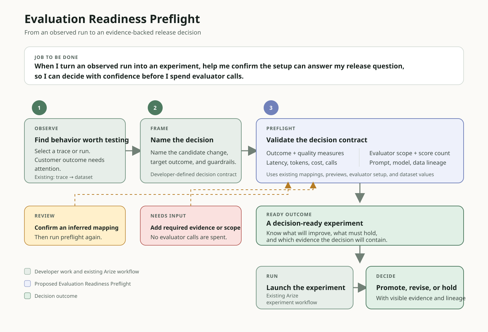

# Product point of view

## Adoption opportunity

Arize already gives developers a useful path from trace inspection to datasets, evaluators, and experiments. It also provides field mapping, automatic matches, sample-value previews, and missing-variable warnings. The next opportunity is decision readiness: confirming that those components will produce the complete evidence needed for the release decision the developer intends to make.

In this project, the dataset existed, but the task input was not named `question`, imported fields were nested, reference evidence was absent, evaluator scopes differed, and operational measures did not automatically appear in the experiment comparison. I could resolve each condition, but only after moving deeper into the workflow. That delayed the moment when I could trust the comparison.

The screenshot also shows why the proposal is narrower than “trace to evaluation.” The trace-to-dataset action already works. Individual mappings can also be inspected. The readiness opportunity appears at the next level: determining whether the combined task, evaluators, operational measures, and lineage can support a promote, revise, or hold decision.

## Proposed investment: Evaluation Readiness Preflight

Insert a decision-level preflight between **Add to Dataset** and the first scored experiment.

The blue step is the proposed addition. The green steps are existing trace, dataset, mapping, evaluator, and experiment capabilities. The developer states the release decision, target outcome, and guardrails. The preflight uses the existing configuration to determine whether the experiment can produce the required evidence.

The preflight would validate a decision contract containing:

1. the candidate change and promote, revise, or hold decision;
2. the target customer outcome and quality guardrails;
3. the latency, token, cost, call, retry, and stop guardrails;
4. the expected evaluators, scopes, and score count;
5. the prompt, policy, model, dataset, contract, and environment lineage.

It would use Arize's existing mappings and previews to verify that each required measure can be produced. Missing inputs, incompatible scope, context limits, and ambiguous mappings would appear as specific reasons to review the setup before launch.

## Why this first

This opportunity sits on the critical path from production evidence to a trustworthy improvement decision. A plausible mapping can be valid on its own while the complete experiment still lacks an operating guardrail, evaluator denominator, or lineage field needed for release review. Builders configuring tasks, operators investigating incomplete runs, and product owners deciding whether to ship a change all depend on this handoff.

## Prioritization across the observed opportunities

I separated changes to this grocery agent from horizontal investments in Arize AX. I also separated observed workflow opportunities that can be corrected from product bets that require validation.

| Opportunity | Evidence from this project | Product scope | Decision |
| --- | --- | --- | --- |
| Evaluation Readiness Preflight | Mapping ambiguity, incompatible evaluator scopes, context failure, missing labels, and blank operational comparisons prevented the configured experiment from becoming one complete release-decision record. | Horizontal developer-adoption path across datasets, evaluators, and experiments. | Build first. It extends existing mappings and previews into a decision-level check supported by the dogfooding evidence. |
| Agent service indicators, objectives, and escalation | `OK` spans coexisted with a failed customer outcome; semantic and deterministic evaluations disagreed; operational measures were difficult to carry into the release decision. | Production operating contract for agents shared across teams or promoted into customer-facing environments. | Validate next. The potential reach is high, but this project alone does not establish the correct defaults or buyer requirements. |
| Trace readiness and cross-request correlation | One exact trace read was temporarily incomplete; hard timeouts could remain only in application logs; OCR and recommendation cross a human-review boundary. | Instrumentation and incident-investigation foundation. | Explore as enabling platform work and a standards hypothesis after the first MVP. |
| Failed-only evaluator retry and explicit denominators | Provider throttling left 37/44 and 36/44 labels, while override retry repeated successful judge calls. | Evaluation execution quality. | Address within the evaluation workflow while keeping Preflight as the primary proposal. |
| Retailer identity and candidate-relevance controls | Prompt C produced valid SQL without usable evidence and retained lexical collisions. | Grocery-agent tool and evidence contract. | Improve in the application and test again. This is not a horizontal Arize feature. |

## MVP

The MVP can stay focused: a read-only decision check for one trace-derived dataset version and one evaluator set. It would show:

- the stated candidate change and release decision;
- the target outcome plus quality and operating guardrails;
- the first three example shapes and representative values;
- the proposed task input and output mappings;
- pass, warning, or blocked status for every evaluator;
- incompatible evaluator scopes;
- missing reference or evidence fields;
- expected, available, and missing score counts;
- version lineage and available operational measures;
- a confirmed handoff to Prompt Playground, Agent Playground, or code.

## Product-level delivery sequence

This proposal reuses Arize's current trace viewer, trace-to-dataset action, dataset mappings and previews, evaluator definitions, experiments, and lineage metadata. The new work validates those components together against a stated release decision.

1. **State the decision contract.** Name the candidate change, target outcome, release guardrails, expected evaluators, and required lineage. Reuse the selected dataset version and existing mappings as evidence.
2. **Validate before spend.** Return pass, warning, or blocked status for the complete decision contract, including mappings, evaluator scopes, context size, score denominator, lineage, and operational measures. A blocked state prevents the first scored run; warnings remain visible in the experiment record.
3. **Preserve the decision record.** Create an experiment stub that carries the confirmed contract into Prompt Playground, Agent Playground, or code. Store the contract with the results so another reviewer can understand why the candidate was promoted, revised, or held.

The first release depends on machine-readable evaluator variables and scope, a stable dataset-version schema with sample values, prompt and model lineage, and a reliable declaration of which operational measures are present. Ambiguous field names create the main product risk: a plausible inferred mapping can produce a valid-looking score against an unintended input. The preflight should show why it proposed each mapping and ask for confirmation when more than one field could satisfy a variable.

The MVP excludes automatic prompt rewriting, expected-answer generation, dataset mutation, evaluator redesign, and automatic remediation. Those actions require separate evidence and user control.

## Limited pilot

Start with developers creating experiments from trace-derived datasets in one Arize space. Limit the pilot to one dataset version and one evaluator set per preflight. Compare the existing workflow with the preflight workflow using the same entry point: **Add to Dataset**.

The pilot should record:

- median time from **Add to Dataset** to the first trusted score;
- percentage of experiments with a stated target outcome and release guardrails;
- percentage of first experiments that produce the expected evaluator labels;
- percentage of mappings changed after the first scored run;
- blocked runs by reason, including missing variables, ambiguous mappings, incompatible scope, and context limits;
- developer confirmation that the scored comparison answered the intended product question;
- reviewer confirmation that the release decision can be understood from the saved record without reconstructing the setup.

For the pilot, a trusted score means that the developer confirmed the mappings, the run produced its expected labels, and no blocking readiness condition remained. A falling time-to-first-trusted-score with a low post-launch correction rate would support broader rollout. Faster execution paired with frequent mapping corrections would signal false confidence.

## Success measures

- median time from **Add to Dataset** to first trusted score;
- percentage of scored experiments whose mappings are corrected after launch;
- percentage of trace-derived datasets that reach a trusted first experiment;
- percentage of invalid evaluator mappings caught before judge calls begin;
- percentage of experiments with complete outcome, guardrail, score-coverage, and lineage evidence;
- developer confirmation that the comparison answers the intended product question.

## Future discovery: agent service objectives

Arize already provides [custom metrics](https://arize.com/docs/ax/observe/projects/custom-metrics-api), [dashboards](https://arize.com/docs/ax/observe/dashboards), [continuous evaluations](https://arize.com/docs/ax/evaluate/online-evals/setting-up-online-evals), monitors, and [alert integrations](https://arize.com/docs/ax/machine-learning/machine-learning/how-to-ml/monitors/configure-monitors/notifications-and-integrations). A further opportunity is a versioned operating contract that helps a team define acceptable agent service once, then use that definition during experiments and in production.

An agent service objective would contain:

- an indicator and its source evidence;
- a target, measurement window, and environment or cohort;
- prompt, policy, model, contract, dataset, and release versions;
- an owner and escalation policy;
- the action permitted when the objective is missed.

The first indicator families should cover:

| Indicator family | Example indicators |
| --- | --- |
| Customer outcome | Supported task-completion rate, critical relevance, correct abstention, and human-review rate |
| Reliability | Invocation success, trace completeness, tool success, timeout rate, and budget-exhaustion rate |
| Efficiency | End-to-end p95 latency, tokens and cost per completed task, tool calls per task, and no-progress loop rate |
| Governance | Policy pass rate, guardrail violations, unauthorized tool attempts, and unresolved human-review state |

The escalation policy should distinguish a warning from an incident. A warning can create an investigation cohort and regression dataset. A sustained reliability breach can notify an operator. A quality or governance breach can route work to human review or send a versioned control signal to the application. Arize can define, measure, explain, and communicate the decision; the customer's runtime should retain enforcement authority.

This is a discovery item after the Preflight MVP. Before making a roadmap commitment, I would validate indicator definitions, ownership, measurement windows, error-budget expectations, and escalation integrations with AI engineers, SREs, and product owners operating shared production agents.

### Product use case: govern a shared production agent

**Target user:** An SRE responsible for an agent platform shared by several product teams.

**Situation:** A team promotes a new prompt, model, or tool-policy version. HTTP success remains healthy, but supported task completion falls, no-progress loops rise, or tool-authorization failures increase. The SRE can see that the service is running but cannot tell whether the agent is still meeting its customer and governance commitments.

**Job:** Determine whether the agent is meeting its approved service contract, identify the affected release and trace cohort, notify the owner, and choose a permitted response.

The product workflow would be:

1. An AI engineer and product manager define a versioned objective set covering customer outcome, reliability, efficiency, and governance.
2. The SRE attaches that objective set to an agent, environment, owner, and release cohort.
3. Arize evaluates production runs and correlates a breach with prompt, model, policy, contract, dataset, application, and infrastructure versions.
4. The breach opens the affected trace cohort, identifies the indicator that crossed its team-defined threshold, and routes the alert to the named owner.
5. The SRE chooses an approved action: continue observing, require human review, degrade to a bounded path, or request a rollback.
6. The customer runtime executes the control and reports the action and subsequent outcome as audit evidence.

The user outcome is one evidence contract that connects customer quality to latency, cost, tool behavior, and policy state. The SRE can investigate a breach without manually joining an application dashboard, agent traces, evaluation results, and release metadata. Product and engineering teams use the same measures to decide whether a candidate may ship and whether the production agent remains healthy.

Arize would define, measure, explain, and route the evidence. The application would retain enforcement authority. That boundary gives the SRE operational control without requiring Arize to become the execution runtime.

I would validate this use case by measuring time from breach to affected cohort, the percentage of breaches with an owner, release version, and selected action, false-escalation rate, and the percentage of release decisions that use the same indicators later monitored in production. These are validation measures, not product claims from this four-case experiment.

## Evidence from Part 2

Prompt B and Prompt C ran against the same four cases, catalog versions, runtime, contract, model configuration, and evaluator versions. Prompt C improved native task completion from 75% to 100%, but critical product relevance fell from three of four cases to zero, total elapsed time increased 93.9%, tool calls increased 45.8%, and completion tokens increased 132.5%.

The evaluation workflow also produced 37 of 44 expected native labels for B and 36 of 44 for C. Provider throttling, a context-window failure, evaluator-scope separation, and all-or-nothing override retry complicated the first trusted comparison. Native evaluators sometimes approved evidence-free abstentions that deterministic evidence checks rejected.

These observations make the preflight the recommended adoption investment. It acts before the developer spends judge calls or interprets an incomplete comparison, and it extends the existing trace-to-dataset and experiment workflows.

[Read the full comparison and evaluator denominator](PART_2_EVALUATE_IMPROVE_DECIDE.md) or [inspect the scrubbed eight-run evidence](../evidence/experiment-runs.json).

## Potential ideas for future discovery

These are follow-on opportunities to explore after the first MVP:

- **Cross-request workflow correlation:** By preserving one workflow and session identity across separate request traces, including asynchronous human review, an AI engineer could follow the complete customer attempt without manually matching timestamps. This would make incomplete workflows easier to investigate and convert into regression cases.
- **Trace-readiness state:** By showing whether root-declared spans and parent links are still indexing or complete, a developer could determine whether a trace is ready for diagnosis or evaluation. This would reduce the chance of treating a partial trajectory as the final agent behavior.
- **Release facets:** By making prompt, model, policy, data, contract, application, and environment versions available as shared filters, a product or engineering team could isolate the exact cohort affected by a change. This would connect a regression to its release configuration more quickly.
- **Evaluation disagreement:** By presenting semantic-judge results beside deterministic execution checks and the expected, completed, failed, and missing score counts, a product manager could see both the result and the strength of its supporting evidence. This would make promote, revise, or hold decisions easier to explain and review.
- **Pre-model invocation state:** By standardizing blocked, failed-to-invoke, timed-out, and disabled outcomes, an SRE could include attempts that ended before a model span was created. This would provide a more complete view of agent-service reliability across the application and AI boundary.
- **Agent service objectives:** By carrying versioned outcome, reliability, efficiency, and governance thresholds from offline release gates into production monitoring, teams could use the same definition of success before and after deployment. This would support consistent alerts, escalation, and human-review decisions.

Together, these ideas extend evidence continuity from investigation through release and production operations. They remain discovery opportunities. Arize would organize, evaluate, and communicate the evidence, while the customer runtime would retain authority to enforce agent actions.
